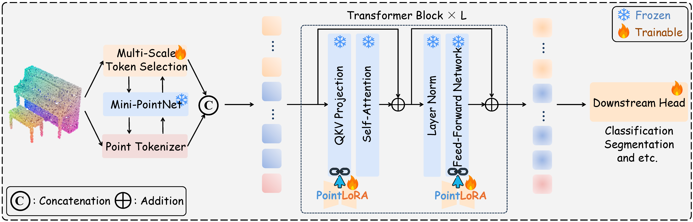

# PointLoRA
> Song Wang, Xiaolu Liu, Lingdong Kong, Jianyun Xu, Chunyong Hu, Gongfan Fang, Wentong Li, Jianke Zhu, Xinchao Wang

This is the official implementation of **PointLoRA: Low-Rank Adaptation with Token Selection for Point Cloud Learning** (CVPR 2025)  [[Paper](https://arxiv.org/pdf/2504.16023)].

<p align="center"> <a></a> </p>


## Preparation

### Environment Setup

We release the PointLoRA implementation with Point-MAE, please refer the environment setup in the [original repo](https://github.com/Pang-Yatian/Point-MAE).


### Dataset Download

We use [ScanObjectNN](https://hkust-vgd.github.io/scanobjectnn), [ModelNet40](https://shapenet.cs.stanford.edu/media/modelnet40_normal_resampled.zip), and [ShapeNetPart](https://shapenet.cs.stanford.edu/media/shapenetcore_partanno_segmentation_benchmark_v0_normal.zip) in this work. Please refer the data processing in [Point-BERT](https://github.com/Julie-tang00/Point-BERT).


## Fine-tuning on Downstream Tasks

Fine-tuning the Point-MAE model **with our proposed PointLoRA**: 

```
# For fine-tuning on PB-T50-RS variant
python main.py --config cfgs/finetune_scan_hardest_pointlora.yaml --ckpts <path/to/pre-trained/model> --finetune_model --exp_name pointlora_finetune
```


## Acknowledgement
We gratefully acknowledge the contributions of various open-source projects that supported this work:
[Point-BERT](https://github.com/Julie-tang00/Point-BERT), [Point-MAE](https://github.com/Pang-Yatian/Point-MAE), [DAPT](https://github.com/LMD0311/DAPT), [PPT](https://github.com/zsc000722/PPT), [Point-PEFT](https://github.com/Ivan-Tang-3D/Point-PEFT).
